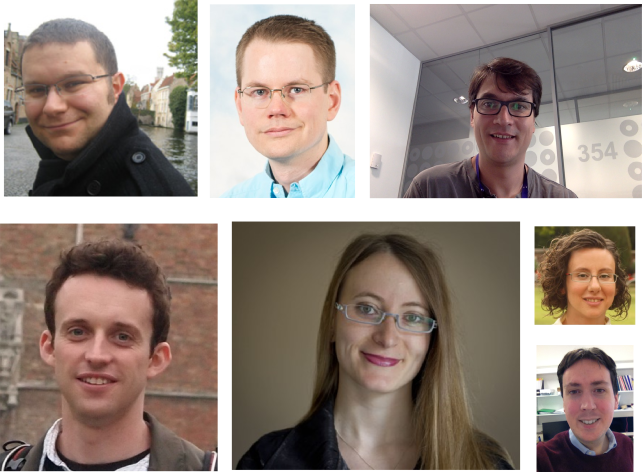
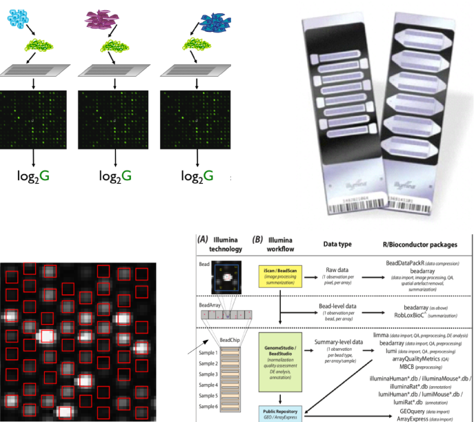
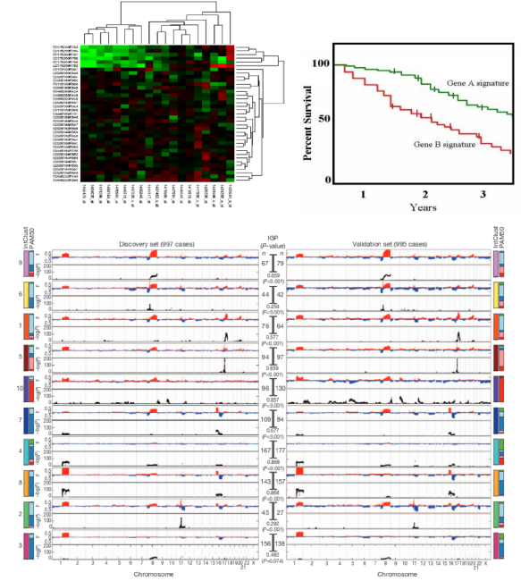
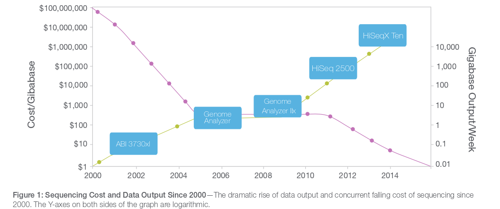

```{r eval=TRUE,echo=FALSE,results='asis'}
BiocStyle::markdown()
```


# Welcome!


## Who's who 



Instructors

- Mark
    + Bioinformatics Training Coordinator, Bioinformatics Core, Cancer Research Uk
- Andy
    + Senior Research Associate, Tavare lab (Statistics and Computational Biology ), Cancer Research Uk
- Oscar
    + Senior Research Associate, Caldas lab (Breast Cancer Genomics), Cancer Research Uk
- Geoff
    + Senior Research Associate, Markowetz (Systems Genetics of Cancer) and Brenton (Functional genomics of ovarian cancer), Cancer Research Uk
    
## Who are you?

```{r eval=FALSE,echo=FALSE}
library(dplyr)
library(xkcd)
ppl <- tbl_df(read.csv("../external-applications-to-filter.csv")) %>% filter(Selected == "Y")

data <- count(ppl, Institute)
data$xmin <- 1:10
data$xmax <- data$xmin+1
data$ymin = 1
data$ymax = data$count

mapping <- aes(xmin = xmin, xmax=xmax, ymin=ymin,ymax=ymax)
xrange <- range(min(data$xmin),max(data$xmax))
yrange <- range(min(data$ymin),max(data$ymax))

p <- ggplot() + xkcdrect(mapping, data) + xkcdaxis(xrange,yrange)
 
```


```{r echo=FALSE, message=FALSE,fig.width=12}
library(dplyr)
library(ggplot2)
library(gridExtra)
ppl <- tbl_df(read.csv("../external-applications-to-filter.csv")) %>% filter(Selected == "Y")
p1 <- ggplot(ppl, aes(x = Institute)) + geom_bar(fill=rgb(29,0,150,maxColorValue=255)) + coord_flip()
p2 <- ggplot(ppl, aes(x=Position)) + geom_bar(fill=rgb(236,0,140,maxColorValue=255)) + coord_flip()
grid.arrange(p1,p2,ncol=2)
```


## Admin


## About the Course

- We will tell about '*best practice*' tools that we use in daily work as Bioinformaticians
- You will (probably) not come away being an expert
- We cannot teach you everything about NGS data
    + plus, it is a fast-moving field
- Whole genome and exome DNA-seq only
    + much of the initial processing is the same for other assays
- However, we hope that you will
    + Understand how your data are processed
    + Be able to explore your data - no programming required
    + Increase confidence with R and Bioconductor
    + Be able to explore new technologies, methods, tools as they come out


## Further disclaimer


> To consult the statistician after an experiment is finished is often merely to ask him to conduct a post mortem examination. He can perhaps say what the experiment died of.”. R.A. Fisher, 1938

If you haven't designed your experiment properly, then all the Bioinformatics we teach you won't help: Consult with your local statistician - preferably **not the day before your grant is due!!!!**

<iframe width="420" height="315" src="https://www.youtube.com/embed/Hz1fyhVOjr4" frameborder="0" allowfullscreen></iframe>

- We have some [materials](http://bioinformatics-core-shared-training.github.io/experimental-design/) you can look at


# Course Outline

## Day 1

- Recap of R
- Overview of NGS data
- Hands-on experience with NGS data
- 

## Day 2

- Theory of SNV-calling
- How SNV calls are represented
- Issues with Somatic calling
- Hands-on practice assessing SNV calls

## Day 3

- Copy-number analysis

## Day 4

- Structural Variants

## Day 5

- Dealing with collections of genomes

# Historical context

## Cast your minds back a few years..



## Plenty of success stories with microarrays




# Why do sequencing?

##Microarrays vs sequencing

- Probe design issues with microarrays
    + *'Dorian Gray effect'* http://www.biomedcentral.com/1471-2105/5/111
    + ' ...mappings are frozen, as a Dorian Gray-like syndrome: the apparent eternal youth of the mapping does not reflect that somewhere the 'picture of it' decays'
- Sequencing data are 'future proof'
    + if a new genome version comes along, just re-align the data!
    + can grab published-data from public repositories and re-align to **your** own choice of genome / transcripts and aligner
- Limited number of novel findings from microarays
    + can't find what you're not looking for!
- Genome coverage
    + some areas of genome are problematic to design probes for
- Maturity of analysis techniques
    + on the other hand, analysis methods and workflows for microarrays are well-established
    + until recently...
    
## The cost of sequencing



##Reports of the death of microarrays


##Reports of the death of microarrays. Greatly exagerated?

http://core-genomics.blogspot.co.uk/2014/08/seqc-kills-microarrays-not-quite.html


## What did we learn from arrays?

- Experimental Design; despite this fancy new technolgy, if we don't design the experiments properly we won't get meaningful conclusions
- Quality assessment; Yes, NGS experiments can still go wrong!
- Normalisation; NGS data come with their own set of biases and error that need to be accounted for
- Stats; testing for RNA-seq is built-upon the knowledge from microarrays
- Plenty of tools and workflows were established.
- ***Don't forget about arrays; the data are all out there somewhere waiting to be discovered and explored***

## Reproducibility is key


Two Biostatiscians (later termed '*Forensic Bioinformaticians*') from M.D. Anderson used R extensively during their re-analysis and investigation of a Clinical Prognostication paper from Duke. The subsequent [scandal](https://www.youtube.com/watch?v=W5sZTNPMQRM) put Reproducible Research on the map.

Keith Baggerly's talk from Cambridge in 2010 is highy-recommended.

<iframe width="420" height="315" src="https://www.youtube.com/embed/7gYIs7uYbMo" frameborder="0" allowfullscreen></iframe>


