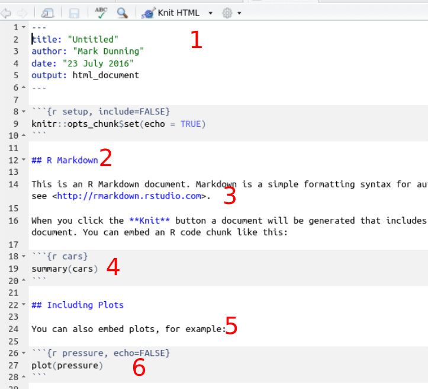

# About the software

## Advantages of R


The R programming language is now recognised beyond the academic community as an effect solution for data analysis and visualisation. [Notable users of R](http://www.revolutionanalytics.com/companies-using-r) include [Facebook](http://blog.revolutionanalytics.com/2010/12/analysis-of-facebook-status-updates.html), [google](http://blog.revolutionanalytics.com/2009/05/google-using-r-to-analyze-effectiveness-of-tv-ads.html), [Microsoft](http://blog.revolutionanalytics.com/2014/05/microsoft-uses-r-for-xbox-matchmaking.html) (who recently [invested](http://blogs.microsoft.com/blog/2015/01/23/microsoft-acquire-revolution-analytics-help-customers-find-big-data-value-advanced-statistical-analysis/) in a commerical provider of R), and the [New York Times](http://blog.revolutionanalytics.com/2011/03/how-the-new-york-times-uses-r-for-data-visualization.html).

## Key features

- Open-source
- Cross-platform
- Access to existing visualisation / statistical tools
- Flexibility
- Visualisation and interactivity
- Add-ons for many fields of research
- Facilitating ***Reproducible Research***

## Support for R

- Online forums such as [Stack Overflow](http://stackoverflow.com/questions/tagged/r) regularly feature R
- [Blogs](http://www.r-bloggers.com/)
- Local [user groups](http://blog.revolutionanalytics.com/local-r-groups.html) 
- Documentation via `?` or `help.start()`


-  Packages analyse all kinds of Genomic data (>800)
- Compulsory documentation (*vignettes*) for each package
- 6-month release cycle
- [Course Materials](http://bioconductor.org/help/course-materials/)
- [Example data](http://bioconductor.org/packages/release/BiocViews.html#___ExperimentData) and [workflows](http://bioconductor.org/help/workflows/)
- Common, re-usable framework and functionality
- [Available Support](https://support.bioconductor.org/)
    + Often you will be able to interact with the package maintainers / developers and other power-users of the project software
- Annual conferences in U.S and Europe
    - The last European conference was in [Cambridge](https://sites.google.com/site/eurobioc2015/)
    
## The Bioconductor project    
    
    
Many of the packages are by well-respected authors and get lots of citations.


##Downloading a package

Each package has its own landing page. e.g. http://bioconductor.org/packages/release/bioc/html/beadarray.html. Here you'll find;

- Installation script (will install all dependancies)
- Vignettes and manuals
- Details of package maintainer
- After downloading, you can load using the `library` function. e.g. `library(beadarray)`
- Only need to download once for each version of R
- CRAN packages installed by `install.packages`
- What packages to install?
    + [METACRAN](http://www.r-pkg.org/) can help


## About the R markdown format

Aside from teaching you about NGS analysis, we also hope to teach you how to work in a reproducible manner. The first step in this process is to master the R markdown format.

Open the file `session2-template.Rmd` in Rstudio now.....



1. Header information
2. Section heading
3. Plain text
4. R code to be run
5. Plain text
6. R code to be run


Each line of R code can be executed in the R console by placing the cursor on the line and pressing `CTRL + ENTER`. You can also highlight multiple lines of code. NB. You do not need to highlight to the backtick (`\``) symbols. Hitting the knit button (*) will run all R code in order and (providing there are no errors!) you will get a PDF or HTML document. The resultant document will contain all the plain text you wrote, the R code, and any outputs (including graphs, tables etc) that R produced. You can then distribute this document to have a reproducible account of your analysis.

## How to use the template

- Change your name, add a title and date in the header section
- Add notes, explanations of code etc in the white space between code chunks. You can add new lines with `ENTER`. Clicking the `?` next to the `Knit HTML` button will give more information about how to format this text. You can introduce **bold** and *italics* for example.
- Some code chunks are left blank. These are for you to write the R code required to answer the questions
- You can try to knit the document at any point to see how it looks

## RStudio


- Rstudio is a free environment for R
- Convenient menus to access scripts, display plots
- Still need to use *command-line* to get things done
- Developed by some of the leading R programmers

# R recap

R has an in-built help system. At the *console*, you can type `?` followed by the name of a function. This will bring-up the documentation for the function; which includes the expected inputs (*arguments*), the output you should expect from the function and some use-cases.

```{r eval=FALSE}
?mean
```

More-detailed information on particular packages is also available (see below)

The **Packages** tab in the bottom-right panel of RStudio lists all packages that you currently have installed. Clicking on a package name will show a list of functions that available once that package has been loaded. The `library` function is used to load a package and make it's functions / data available in your current R session. *You need to do this every time you load a new RStudio session*. 


```{r eval=FALSE}
library(beadarray)
```

There are functions for installing packages within R. If your package is part of the main **CRAN** repository, you can use `install.packages`

We will be using the `wakefield` R package in this practical. To install it, we do.

```{r eval=FALSE}
install.packages("wakefield")
```

*Bioconductor* packages have their own install script, which you can download from the Bioconductor website

```{r eval=FALSE}
source("http://www.bioconductor.org/biocLite.R")
biocLite("affy")
```

A package may have several *dependancies*; other R packages from which it uses functions or data types (re-using code from other packages is strongly-encouraged). If this is the case, the other R packages will be located and installed too.

So long as you stick with the same version of R, you won't need to repeat this install process.


## Getting started
We are going to explore some of the basic features of R using some patient data; the kind of data that we might encounter in the wild. However, rather than using real-life data we are going to make some up. There is a package called `wakefield` that is particularly convenient for this task.


```{r}
library(wakefield)
```

Various patient characteristics can be generated. The following is a function that uses the package to create a *data frame* with various clinical characteristics. The number of patients we want to simulate is an argument.

Don't worry about what the function does, you can just paste the following into the R console, or highlight it in the the markdown template and press `CTRL + ENTER` to run.

```{r}
random_patients <- function(n) {
  as.data.frame(r_data_frame(
    n,
    id,
    name,
    race,
    sex,
    smokes,
    height,
    birth(random = TRUE, x = NULL, start = Sys.Date() - 365 * 45, k = 365*2,by = "1 days"),
    state,
    pet,
    grade_level(x=1:3),
    died,    
    normal(name="Count"),
    date_stamp)
  )
}

```

```{r echo=FALSE}
set.seed(29032016)
```


We can now use the `random_patients` function to generate a data frame of fictitious patients

```{r eval=FALSE}
patients <- random_patients(100)
```

```{r echo=FALSE}
patients <- random_patients(10)
```


In Rstudio , you can view the contents of this data frame in a tab.

```{r eval=FALSE}
View(patients)
```


******

## Q. What are the dimensions of the data frame?

## Q. What columns are available?

*** HINT: see the `dim`, `ncol`, `nrow` and `colnames` functions
 
******


```{r echo=FALSE}
dim(patients)
colnames(patients)
```

******
## Q. Can you think of two ways to access the Names of the patients?
## Q. What type of object is returned?

******
```{r echo=FALSE}
patients$Name
patients[,2]
```

We can access the columns of a data frame by either

- knowing the column index
- knowing the column name

By column name is recommended, unless you can guarentee the columns will also be in the same order

***TOP TIP:*** Use auto-complete with the <TAB> key to get the name of the column correct

A vector (1-dimensional) is returned, the length of which is the same as the number of rows in the data frame. The vector could be stored as a variable and itself be subset or used in further calculations

```{r}
peeps <- patients$Name
peeps
length(peeps)
nchar(peeps)
substr(peeps,1,3)
```


The `summary` function is a useful way of summarising the data containing in each column. It will give information about the *type* of data (remember, data frames can have a mixture of numeric and character columns) and also an appropriate summary. For numeric columns, it will report some stats about the distribution of the data. For categorical data, it will report the different *levels*.


```{r}
summary(patients)
```

******
## Q. Can you identify
### which columns contain numerical data?
### which columns contain categorical data?
### which columns contain logical (`TRUE` or `FALSE`) values?
    
******

## Subsetting

A data frame can be subset using square brackes`[]` placed after the name of the data frame. As a data frame is a two-dimensional object, you need a *row* and *column* index, or vector indices. 

******
## Q. Make sure you can understand the behaviour of the following commands
******

```{r eval=FALSE}
patients[1,2]
patients[2,1]
patients[c(1,2,3),1]
patients[c(1,2,3),c(1,2,3)]
```

***Note that the data frame is not altered*** we are just seeing what a subset of the data looks like and not changing the underlying data. If we wanted to do this, we would need to create a new variale.

```{r}
patients
```


Should we wish to see all rows, or all columns, we can neglect either the row or column index

******
## Q. Make sure you can understand the behaviour of the following commands
******


```{r}
patients[1,]
patients[,1]
patients[,c(1,2)]
```


******
## Q. How can we view all information about the first six patients?

*** HINT `head` is commonly-used to give a snapshot of a data frame.
Otherwise, you can use the `[row,column]` notation.

******

```{r echo=FALSE}
head(patients)
```

Rather than selecting rows based on their *numeric* index (as in the previous example) we can use what we call a *logical test*. This is a test that gives either a `TRUE` or `FALSE` result. When applied to subsetting, only rows with a `TRUE` result get returned.

For example we could compare the `Count` variable to zero. The result is a *vector* of `TRUE` or `FALSE`; one for each row in the data frame


```{r}
patients$Count < 0
```

This R code can be put inside the square brackets.

```{r}
patients[patients$Count<0, ]
```

If we wanted to know about the patients that had died, we could do;

```{r}
deceased <- patients[patients$Died == TRUE,]
deceased
```

In fact, this is equivalent

```{r}
deceased <- patients[patients$Died,]
```

The test of equality `==` also works for text

```{r}
patients[patients$Race == "White",]
```


******
## Q. Can you create a data frame of dog owners?

******


```{r echo=FALSE}
dog_owners <- patients[patients$Pet == "Dog",]
dog_owners
```

There are a couple of ways of testing for more than one text value. The first uses an *or* `|` statement. i.e. testing if the value of `Pet` is `Dog` *or* the value is `Cat`.

The `%in%` function is a convenient function for testing which items in a vector correspond to a defined set of values.

```{r}
patients[patients$Pet == "Dog" | patients$Pet == "Cat",]
patients[patients$Pet %in% c("Dog","Cat"),]
```

Similar to *or*, we can require that both tests are `TRUE` by using an *and* `&` operation. e.g. to look for white males.

```{r}
patients[patients$Race == "White" & patients$Sex =="Male",]
```


******
## Q. Can you create a data frame of deceased patients with a 'count' < 0

******

```{r echo=FALSE}
patients[patients$Count <0 & patients$Died,]
```

## Ordering and sorting

A vector can be returned in sorted form using the `sort` function.

```{r}
sort(peeps)
sort(patients$Count,decreasing = TRUE)
```

However, if we want to sort an entire data frame a different approach is needed. The trick is to use `order`. Rather than giving a sorted set of *values*, it will give sorted *indices*. 

```{r}
patients[order(patients$Count),]
patients[order(patients$Sex),]
```

A final point on data frames is that we can export them out of R once we have done our data processing. 

```{r}
countOrder <- patients[order(patients$Count),]
write.csv(countOrder, file="patientsOrderedByCount.csv")
```


## Simple plotting
All your favourite types of plot can be created in R

```{r echo=FALSE}

par(mfrow=c(2,2))
barplot(VADeaths, beside = TRUE,
        col = c("lightblue", "mistyrose", "lightcyan",
                "lavender", "cornsilk"), ylim = c(0, 100))
boxplot(len ~ dose, data = ToothGrowth,
        boxwex = 0.25, at = 1:3 - 0.2,
        subset = supp == "VC", col = "yellow",
        main = "Guinea Pigs' Tooth Growth",
        xlab = "Vitamin C dose mg",
        ylab = "tooth length",
        xlim = c(0.5, 3.5), ylim = c(0, 35), yaxs = "i")
boxplot(len ~ dose, data = ToothGrowth, add = TRUE,boxwex = 0.25, at = 1:3 + 0.2,subset = supp == "OJ", col = "orange")
legend(2, 9, c("Ascorbic acid", "Orange juice"),fill = c("yellow", "orange"))
set.seed(14)
x <- rchisq(100, df = 4)
## if you really insist on using hist() ... :
hist(x, freq = FALSE, ylim = c(0, 0.2))
curve(dchisq(x, df = 4), col = 2, lty = 2, lwd = 2, add = TRUE)
pie(c(Sky = 78, "Sunny side of pyramid" = 17, "Shady side of pyramid" = 5),
    init.angle = 315, col = c("deepskyblue", "yellow", "yellow3"), border = FALSE)
```

## Plotting

- Simple plots are supported in the *base* distribution of R (what you get automatically when you download R). 
    + `boxplot`, `hist`, `barplot`,... all of which are extensions of the basic `plot` function
- Many different customisations are possible
    + colour, overlay points / text, legends, multi-panel figures
- We will show how some of these plots can be used to inform us about the quality of NGS data, and to visualise our results.
- References..
    + [Introductory R course](http://cambiotraining.github.io/r-intro/)
    + [Quick-R](http://www.statmethods.net/graphs/index.html)

```{r}
hist(patients$Height)
```


```{r}
plot(patients$Height,patients$Count)
```


```{r}
barplot(table(patients$Race))
```

```{r}
barplot(table(patients$Pet))
```


```{r}
boxplot(patients$Count ~ patients$Died)
```

*Lots* of customisations are possible to enhance the appaerance of our plots; colour, labels, axes, legends

```{r}
plot(patients$Height,patients$Count,pch=16,
     col="red",xlab="Height",
     ylab="Count")
```


```{r}
boxplot(patients$Count ~ patients$Died,col=c("red","yellow"))
```

Plots can be exported by the ***Plots*** tab in RStudio, or by calling the `pdf` or `png` functions which will write the plot to a file

 
 
```{r}
png("myLittlePlot.png")
barplot(table(patients$Pet))
dev.off()
```
